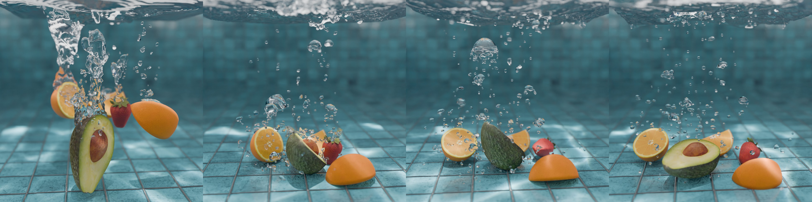

# BubbleGym: A Practical Shape-to-Frequency Model for Acoustic Bubbles

**SIGGRAPH Asia 2026 Conference Papers**



[Zhehao Li](https://zhehaoli1999.github.io/)<sup>1</sup> &nbsp;·&nbsp;
[Kui Wu](https://kuiwuchn.github.io/)<sup>2</sup> &nbsp;·&nbsp;
[Wei Li](https://lwkobe.github.io/)<sup>3</sup> &nbsp;·&nbsp;
[Doug L. James](https://graphics.stanford.edu/~djames/)<sup>1</sup>

<sup>1</sup>Stanford University &nbsp;&nbsp;
<sup>2</sup>Independent Researcher &nbsp;&nbsp;
<sup>3</sup>Shanghai Jiao Tong University

[Paper (ACM DL)](https://doi.org/10.1145/3829340.3842193) ·
[Project page](index.html) ·
[Benchmark CSV](dataset/bubble_gym/dataset_bubblegym_10k.csv)

## Abstract

Water sounds are dominated by the acoustic radiation of entrained air bubbles.
The resonant frequency of a bubble depends critically on its size, shape, and
proximity to nearby boundaries, and is governed by the capacitance of the bubble
in the exterior mixed-boundary Laplace problem. Existing bubble-frequency models
face a difficult trade-off: spherical approximations are efficient but inaccurate
for deformed bubbles common in fluid simulations, incurring multiple semitones of
pitch error, whereas boundary element methods (BEM) accurately account for
nonspherical geometry but are prohibitively expensive.

We present *BubbleGym*, a framework for efficient, shape-aware bubble source
modeling. It introduces a benchmark dataset of 10k nonspherical bubble meshes
with ground-truth resonant frequencies. We first propose a moment-matching
ellipsoidal proxy model, which improves efficiency but remains limited on
strongly deformed shapes, then adopt a learned, compact, scale-invariant mapping
from a curated set of shape features to resonant frequency. The resulting model
runs up to 1428× faster than BEM while holding mean frequency error below 1 %
(under 17 cents, beneath the perceptual JND for transient sounds) on the test
set. Integrated into a complete water-sound synthesis pipeline, it enables
high-fidelity audio for complex, bubble-rich scenes at a fraction of the cost of
direct BEM evaluation.

## What is here

This repository covers the benchmark dataset and the shape-to-frequency models
of the paper. Each directory has its own README with the details.

| Directory | What it holds |
|---|---|
| [`dataset/`](dataset) | The 10k benchmark CSV and the four paper scenes, each with one `trackedBubInfo` per frequency model. See [`dataset/README.md`](dataset/README.md) for the file format and scene provenance |
| [`python/`](python) | All code, in eight packages: the BEM solver, the eight shape descriptors, the models and ablations with trained weights, the format layer, and the per-scene drivers. See [`python/README.md`](python/README.md) |
| [`results/experiments/`](results/experiments) | Every figure and table, one folder each, holding the plot and the raw data behind it. See [`results/experiments/README.md`](results/experiments/README.md) |

## Getting started

```bash
conda create -n soundlab python=3.11 -y
conda activate soundlab

pip install numpy scipy pandas matplotlib   # enough to read the data and plot
pip install -r requirements.txt             # full stack: torch, bempp-cl, ...
```

Run everything from the repository root with `PYTHONPATH=python`. The scene files
are tracked with git-LFS, so run `git lfs install` before cloning or the working
tree gets pointer stubs instead of data.

**Predict frequencies for a scene.** Each scene ships one
`trackedBubInfo_<model>.txt` per frequency model, all sharing one bubble graph
and differing only in the frequency column, so any two are directly comparable.
The three writers in `python/scene/_common/` take the same shape, a base tracked
file in and a frequency column out:

```bash
python python/scene/_common/write_trackedbubinfo_nn.py \
    --tracked <scene>/trackedBubInfo.txt --out <scene>/trackedBubInfo_NN.txt

python python/scene/_common/write_trackedbubinfo_bem.py \
    --tracked <scene>/trackedBubInfo_NN.txt --rows-csv <sweep>_all_rows.csv \
    --out <scene>/trackedBubInfo_BEM.txt --dt-lbm <seconds per LBM step>

python python/scene/_common/replace_trackedbubinfo_freq_with_minnaert.py \
    --src <scene>/trackedBubInfo_NN.txt --out <scene>/trackedBubInfo_Minnaert.txt
```

For a single mesh rather than a scene, `python/freq_model/NN/nn_inference.py`
runs the surrogate directly and `python/bem/compute_freq_bempp_galerkin.py`
solves the BEM reference.

**Reproduce a figure or table.** Every trained model and ablation variant ships
with its weights, so nothing needs retraining.
[`results/experiments/README.md`](results/experiments/README.md) gives the
command and the data for each one, and records which paper numbers are
regenerable, which are not, and why.

## License

MIT. See [`LICENSE`](LICENSE).

## Citation

```bibtex
@inproceedings{li2026bubblegym,
  author    = {Li, Zhehao and Wu, Kui and Li, Wei and James, Doug L.},
  title     = {BubbleGym: A Practical Shape-to-Frequency Model for Acoustic Bubbles},
  booktitle = {SIGGRAPH Asia 2026 Conference Papers (SA Conference Papers '26)},
  year      = {2026},
  location  = {Kuala Lumpur, Malaysia},
  publisher = {Association for Computing Machinery},
  address   = {New York, NY, USA},
  doi       = {10.1145/3829340.3842193},
  isbn      = {979-8-4007-2842-6}
}
```
